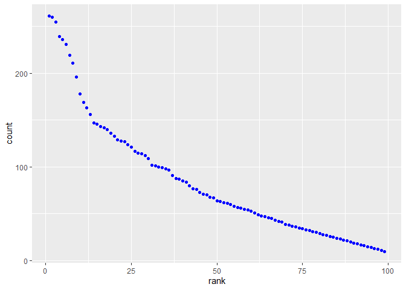

p8105\_hw2\_mrc2229
================
Matthew Curran
10/1/2019

Problem 1
=========

Reading and cleaning the Mr. Trashwheel Sheet
---------------------------------------------

``` r
trashwheel_data = read_excel(
  "./hw2_data/Trash-Wheel-Collection-Totals-8-6-19.xlsx", 
  sheet = 1, 
  range = "A2:N406",
  ) %>%
  janitor::clean_names() %>%
  drop_na(dumpster) %>%
  mutate(sports_balls = as.integer(sports_balls))
```

Read and clean the 2017 and 2018 Precipitation Data
---------------------------------------------------

``` r
precip_2017_data = read_excel(
  "./hw2_data/Trash-Wheel-Collection-Totals-8-6-19.xlsx", 
  sheet = 6,
  skip = 1,
  range = "A2:B14") %>%
  janitor::clean_names() %>%
  rename (precip_inches=total) %>%
  mutate(year=2017)

precip_2018_data = read_excel(
  "./hw2_data/Trash-Wheel-Collection-Totals-8-6-19.xlsx" , 
  sheet = 5,
  skip = 1,
  range = "A2:B14") %>%
  janitor::clean_names() %>%
  rename (precip_inches=total) %>%
  mutate(year=2018)
```

Combine the two Precipitaion Data Sets
--------------------------------------

``` r
precip_data =
  bind_rows(precip_2017_data, precip_2018_data)%>%
  janitor::clean_names() %>%
  transform(month=month.name[month])
```

Describe the Mr. Trash Wheel Data Sets
--------------------------------------

There are 344 observations in the trashwheel data set and 14 variables. Some of the key variables include weight\_tons, which is the amount of trash collected that month in tons, and volume\_cubic\_yards, which gives the volume of the trash. We also can see things like the about of sports balls Mr. Trash wheel collected in a month or over a period of time. For example, Mr. Trashwheel collected a median of 8 sports balls in 2017.

There are 24 observations in the trashwheel data set and 3 variables. This data set contains the amount of precipitation in inches for every month of 2017 and 2018. So we can use it to show things like the total precipitation in 2018, which is 70.33 inches.

Problem 2
=========

Reading, cleaning, and merging the FiveThirtyEight data.
--------------------------------------------------------

``` r
pols_month_data = read_csv ("./hw2_data/fivethirtyeight_datasets/pols-month.csv") %>%
  janitor::clean_names() %>%
  separate(col = mon, into = c("year","month","day")) %>%
  mutate(month=as.numeric(month)) %>%
  transform(month=month.abb[month]) %>%
  mutate(president = recode(prez_gop, `1` = "gop", `0` = "dem")) %>%
  select (-prez_gop, -prez_dem, -day)
```

    ## Parsed with column specification:
    ## cols(
    ##   mon = col_date(format = ""),
    ##   prez_gop = col_double(),
    ##   gov_gop = col_double(),
    ##   sen_gop = col_double(),
    ##   rep_gop = col_double(),
    ##   prez_dem = col_double(),
    ##   gov_dem = col_double(),
    ##   sen_dem = col_double(),
    ##   rep_dem = col_double()
    ## )

    ## Warning: Unreplaced values treated as NA as .x is not compatible. Please
    ## specify replacements exhaustively or supply .default

``` r
snp_data = read_csv(
  "./hw2_data/fivethirtyeight_datasets/snp.csv"
  ) %>%
  janitor::clean_names() %>%
  separate(col = date, into = c("month","day", "year")) %>%
  mutate(month=as.numeric(month)) %>%
  arrange (year, month) %>%
  transform(month=month.abb[month]) %>%
  select (year, month, day, close)
```

    ## Parsed with column specification:
    ## cols(
    ##   date = col_character(),
    ##   close = col_double()
    ## )

``` r
unemployment_data = read_csv(
  "./hw2_data/fivethirtyeight_datasets/unemployment.csv"
  ) %>%
  pivot_longer(
    Jan:Dec,
    names_to = "month",
    values_to = "unemployment_rate"
    ) %>%
  janitor::clean_names()%>%
  mutate(year=as.character(year))
```

    ## Parsed with column specification:
    ## cols(
    ##   Year = col_double(),
    ##   Jan = col_double(),
    ##   Feb = col_double(),
    ##   Mar = col_double(),
    ##   Apr = col_double(),
    ##   May = col_double(),
    ##   Jun = col_double(),
    ##   Jul = col_double(),
    ##   Aug = col_double(),
    ##   Sep = col_double(),
    ##   Oct = col_double(),
    ##   Nov = col_double(),
    ##   Dec = col_double()
    ## )

``` r
snp_pol_data = 
  left_join(pols_month_data, snp_data, by = c("year","month"))


fivethirtyeight_data = 
  left_join(snp_pol_data, unemployment_data, by = c("year", "month")) %>%
  mutate(year=as.numeric(year))
```

Describe the FiveThirtyEight Data Sets
--------------------------------------

In the pols\_month\_data data set we can see the amount of represation each party has in the house and senate, as well as each party's control over governorships and the presidency. The snp\_data shows the closing values of the S&P stock market on the associated date. Lastly, unemployment\_data shows the percentage of people unemployed for each month of every year.

These data sets were merged into one data set called fivethirtyeight\_data that contains all of the above information. This combined data is the size of the dataset is 822 rows by 12 columns and contains years from 1947 to 2015.

Problem 3
=========

Read and clean the popular baby names data.
-------------------------------------------

``` r
pop_baby_names_data = read_csv ("./hw2_data/Popular_Baby_Names.csv") %>%
  janitor::clean_names() %>%
  mutate(childs_first_name = tolower(childs_first_name)) %>%
  mutate(ethnicity = tolower(ethnicity)) %>%
  mutate(gender = tolower(gender)) %>%
  mutate(
    ethnicity = if_else (ethnicity=="black non hisp", "black non hispanic", ethnicity),
    ethnicity = if_else (ethnicity=="white non hisp", "white non hispanic", ethnicity),
    ethnicity = if_else (ethnicity=="asian and paci", "asian and pacific islander", ethnicity)
  ) %>%
  distinct()
```

    ## Parsed with column specification:
    ## cols(
    ##   `Year of Birth` = col_double(),
    ##   Gender = col_character(),
    ##   Ethnicity = col_character(),
    ##   `Child's First Name` = col_character(),
    ##   Count = col_double(),
    ##   Rank = col_double()
    ## )

Popularity of the name Olivia
-----------------------------

``` r
olivia_data = pop_baby_names_data %>%
  filter (childs_first_name=="olivia") %>%
  select (year_of_birth, ethnicity, rank) %>%
  arrange (year_of_birth) %>%
  pivot_wider(
    names_from = "year_of_birth",
    values_from = "rank"
  )
```

| ethnicity                  |  2011|  2012|  2013|  2014|  2015|  2016|
|:---------------------------|-----:|-----:|-----:|-----:|-----:|-----:|
| asian and pacific islander |     4|     3|     3|     1|     1|     1|
| black non hispanic         |    10|     8|     6|     8|     4|     8|
| hispanic                   |    18|    22|    22|    16|    16|    13|
| white non hispanic         |     2|     4|     1|     1|     1|     1|

Scatterplot showing how number of children with a name affects rank in popularity of that name for white non-hispanic male children born in 2016
------------------------------------------------------------------------------------------------------------------------------------------------

``` r
male_name_scatterplot = pop_baby_names_data %>% 
  filter(gender=="male") %>%
  filter(ethnicity=="white non hispanic") %>%
  filter(year_of_birth=="2016") %>%
  ggplot(aes(x = rank, y = count)) + 
  geom_point(color="blue")
male_name_scatterplot
```


